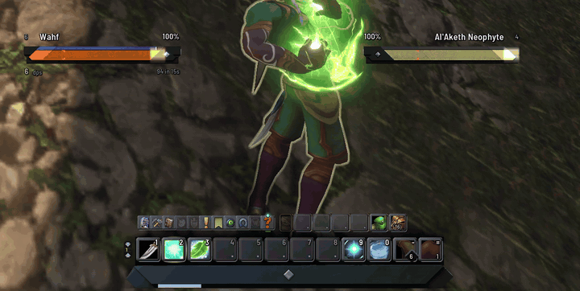
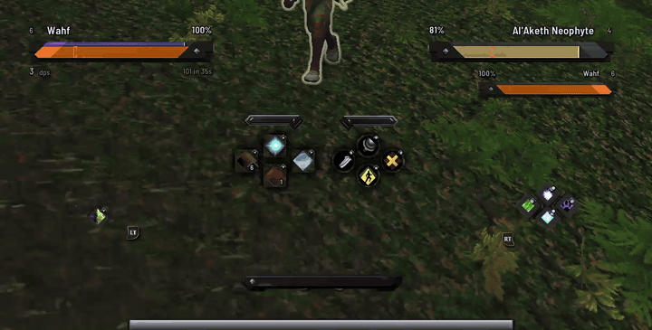
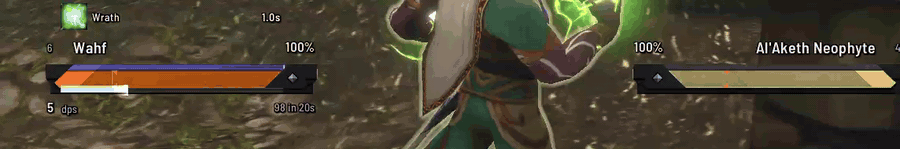
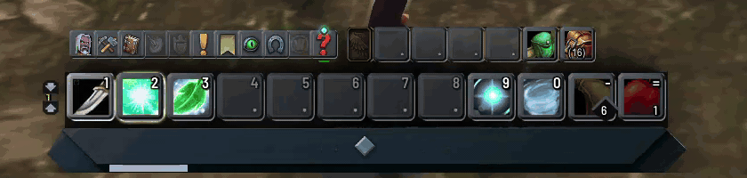
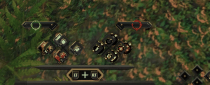
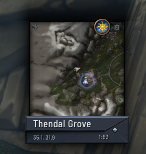
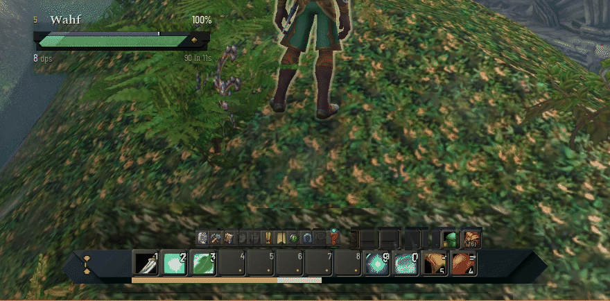
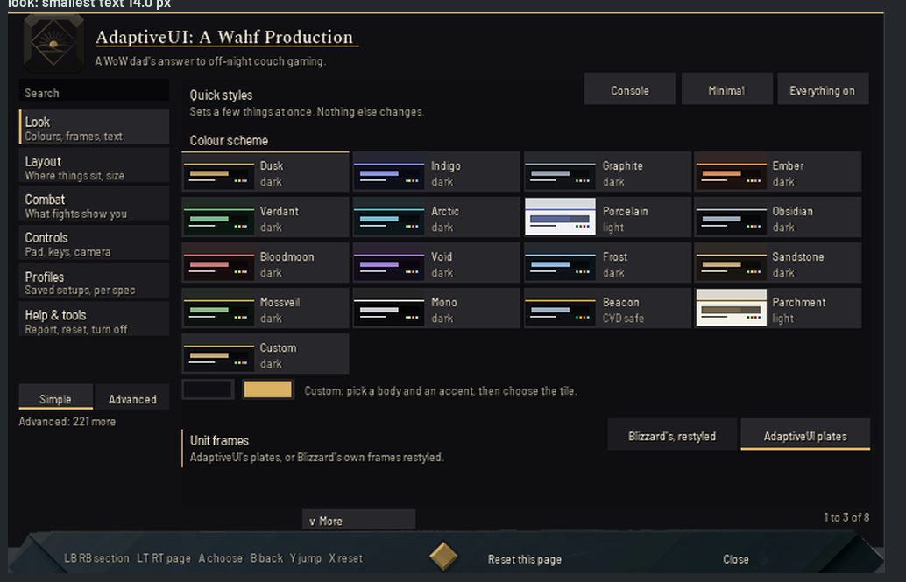
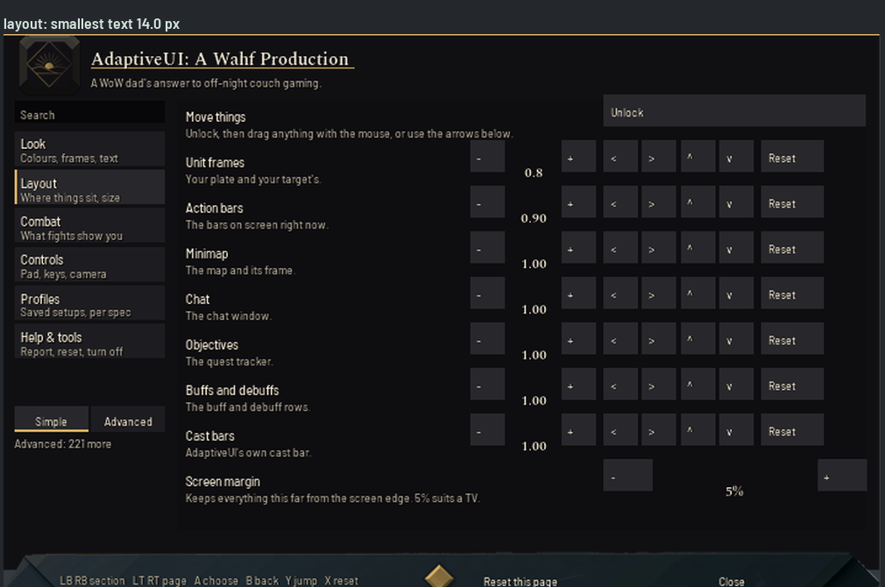

  

<h1 align="center">AdaptiveUI</h1>

<b>A WoW dad's answer to off-night couch gaming.</b> 
A console-RPG / action-combat HUD for WoW Classic "Forever". Controller first. Mouse and keyboard fully supported.

  

  <a href="https://github.com/wahfcore/AdaptiveUI/releases">Download</a> ·
  <a href="docs/install.md">Install</a> ·
  <a href="docs/features.md">Everything it does</a> ·
  <a href="#reporting-bugs">Report a bug</a>

---

## Hi, I'm Wahf

Hi, I'm Wahf, a Vanilla to Retail WoW veteran, raider and content pursuer. I'm retired from WoW and, like most aging
millennial dad gamers, WoW Forever caught my eye.

I have always made addons and UIs for Retail WoW, and I wanted to take on the challenge of a passion project UI for WoW
Forever, something I personally would be comfortable using forever.

I did not make this for everyone, I made it for me. But I am hoping that some people might enjoy what I have put together.

I appreciate the default WoW UI and wanted to preserve its simplicity while adding in my own flair for modern magic.

The painted art is mine. The plates, the action bar, the compass, the map plaque: every piece is my own art, made
from my own hand-drawn references, and the addon uses it exactly as I made it. I built the HUD for a couch and a controller, the way I
actually play on an off night, but it works great on mouse and keyboard too. It stays out of your way, it respects the
default UI underneath, and it should feel obvious from the first minute: the game plays exactly like the game you know,
it just looks and reads the way I always wanted it to.

## What you get

- **A HUD you can read from the couch.** Big, calm unit plates with health always shown as a percent, a cast bar that
  runs inside the plate, and text that never drops below a readable size.
- **Made for a controller, fine on a keyboard.** A gamepad action-bar "compass" with button glyphs when you play on a
  pad, a painted keyboard bar when you don't. Pick up a controller and I'll point you to Blizzard's Gamepad Mode switch; flip it and the HUD follows by itself.
- **Blizzard's UI, restyled, not replaced.** Appearance only. Every Blizzard frame, keybinding and macro still works
  exactly as before.
- **Yours to arrange.** Move and resize my plates, cast bars, minimap, chat and info strips; Blizzard's own bars and
  frames stay in Edit Mode and my art follows them. Sixteen colour schemes; profiles per character or per spec.
- **Safe by design.** It never touches combat logic, never automates anything, and stands itself down if the game
  ever refuses one of its changes. See [Safety](#safety).

## What it looks like

| | |
|---|---|
|  |  |
| **In combat on a controller.** My painted plates, the compass, the casts. | **Plates in combat.** My cast runs inside my plate; the target's cast and health sit in theirs. |
|  |  |
| **Keyboard bar in combat.** Blizzard's buttons standing on my painted bar, with the menu row above. | **The gamepad compass.** The bound buttons light up when you hold a bumper or trigger. |
|  |  |
| **The map on my painted plaque**, zone, coordinates and clock set into it. Chat and the quest tracker get the same quiet style. | **Sixteen colour schemes** and a build-your-own, with the painted art recoloured to match. |
|  |  |
| **Settings in six sections**, Simple or Advanced, with search. Works with a controller. | **Size and place.** Size, nudge and reset each piece; unlock to drag. |

The combat clips and the map are recorded in game; the other pictures are rendered from the addon's own frames. The full list, in plain
words, is in [docs/features.md](docs/features.md).

## Install

Pick one. All of them are the same addon.

1. **The one-click installer (Windows).** Download `AdaptiveUI-Setup.exe` from the [releases page](https://github.com/wahfcore/AdaptiveUI/releases),
   run it, press Install. It works offline: it finds your game, backs up anything already there, installs, and checks
   every file. I haven't paid for code-signing yet, so Windows will say "Windows protected your PC" once: choose
   *More info*, then *Run anyway*. You can check the download against the SHA-256 on the release page first.
2. **Manual zip (Windows, macOS).** Download `AdaptiveUI-<version>.zip`, unzip it, and put the `AdaptiveUI` folder in
   `World of Warcraft/_classic_beta_/Interface/AddOns/`.
3. **CurseForge / Wago** (once listed): install through your addon manager, no warnings at all.

Step-by-step, including where the folders are, how to check it loaded, and how to uninstall: [docs/install.md](docs/install.md).

## First run

1. Log in. A short **welcome** (six screens, controller first) asks how you play, what screen you play on (monitor, TV
   or handheld), which unit frames you want (my **plates**, or **Blizzard's frames, restyled**), and a look. Everything
   applies as you pick it, and nothing in it is permanent.
2. Type **`/aui`** any time to open the settings. **`/aui welcome`** reruns the welcome. On a controller, bind a button
   to "Open AdaptiveUI options" in Key Bindings, or go through Esc > Options > AddOns.
3. **Raise your action bar a little in Edit Mode** (Esc > Edit Mode, drag the main action bar up). Blizzard's default
   puts the bar right on the bottom edge, so there's no room under it for my painted bar; there, the painting sits behind
   the buttons instead. Move the bags and menu wherever you like. Edit Mode remembers it all.
4. Want to move my pieces? **`/aui movers`** opens the Layout page; unlock the movers and drag.
5. **Keyboard vs gamepad.** Button pictures can follow whichever device you touched last, or you can pin one. If you pick up a controller while the keyboard bar is showing, a small box in the bottom right shows you where
   Blizzard's Gamepad Mode switch is (Esc > Options > Gamepad). Blizzard keeps that setting for itself, so I don't
   flip it for you; once you do, the HUD swaps to the compass on its own, and back again.

Handy commands: `/aui` settings, `/aui welcome`, `/aui movers`, `/aui profile list`, `/aui status`, `/aui build`, `/aui reset`.

## Safety

**AdaptiveUI changes how the game looks. It does not change what the game does.**

What it never does:

- It never plays for you: no automation, no auto-targeting, no rotation help, no reading of information the game hides
  from addons. It does not press buttons, cast, target or move you.
- It never touches your keybinds or macros.
- It never replaces or "takes over" Blizzard's protected frames. It restyles them (colours, textures, fonts) and draws
  its own pieces beside them. It never moves or resizes Blizzard's action bars, unit frames, buffs, tooltips or quest
  tracker: on this version of the game that breaks their cooldowns and health, so Edit Mode places those.
- It never does arithmetic on, compares, or prints the values Blizzard now hides from addons in combat ("secret
  values": some health, power and cast numbers). Where the game will not tell it a number, it hands the raw value
  straight to the game's own bar to draw, or shows nothing.
- It never uses the network, and it saves nothing but its own settings file.
- Animation only ever happens on pieces the addon made itself.

If I ever get it wrong: the addon checks the game build it is running on. A build I have tested runs in full.
A brand-new patch on the same version line runs in full but on a short leash: the first time the game blocks
something the addon tried, it **stands down for that build**, leaving Blizzard's own UI as it was, and tells you.
A very different version, or a build where the frames it needs look changed, loads and touches nothing. `/aui build`
tells you which of these you are in; `/aui quarantine clear` then `/reload` lets it try again after a fix.

The rules I follow and where they come from: [docs/safety.md](docs/safety.md).

## FAQ

**Is this for Retail?** No. I built it for the WoW Classic "Forever" client (interface 16001) and have not run it anywhere else.

**Will it get me banned?** It is an appearance addon that follows Blizzard's addon policy (see Safety). I can't promise
anything on Blizzard's behalf, but it does nothing an addon isn't allowed to do.

**Does it work with other addons?** It restyles Blizzard's own UI, so it will not get along with another addon that
restyles the same frames. Everything it does can be switched off per piece in the settings.

**Can I just use the parts I like?** Yes. Unit frames, cast bars, keyboard bar, compass, map, chat, tracker, info
strips and the damage strip are each their own switch.

**Where are my settings?** In your `WTF` folder, in `SavedVariables\AdaptiveUI.lua` (account) and a per-character
backup copy. Reinstalling or updating never touches them. `/aui profile` manages profiles, `/aui profile export` gives
you a string you can send to a friend.

**Something looks wrong after a game patch.** See `/aui build`. If it says it stood down, `/aui quarantine clear` and `/reload`.

**My painted action bar is behind the buttons / squashed at the bottom.** Blizzard's Edit Mode put the bar on the very
bottom edge. Esc > Edit Mode, drag the action bar up a little, and it stands on the art.

**Is it free?** Yes, free to use. It is not open source: see [Licence](#licence).

**Why is there a `.backup-` folder next to it?** The installer keeps the copy it replaced,
as `AdaptiveUI.backup-<date>-<time>`. Delete it whenever you like.

## Reporting bugs

The best bug report is one where I can see what your game saw.

1. Get the problem on screen, then type **`/aui inspect`** and **`/reload`** (the report is written to disk on reload).
2. Find your saved-variables file, per character:
   `World of Warcraft\_classic_beta_\WTF\Account\<ACCOUNT>\<Realm>\<Character>\SavedVariables\AdaptiveUI.lua`
3. Type **`/aui status`** and copy what it prints (it also shows the last few logins).
4. Open an [issue](https://github.com/wahfcore/AdaptiveUI/issues/new), tell me what you expected and what happened, attach the file (or paste the
   `/aui status` text), and add a screenshot. Please say which game build you're on (`/aui build`).

The file is the addon's own settings plus a report of how your UI is laid out. It never holds a password, but it is
your file: look through it before you send it to me if you like.

## Credits

- Everything, code and painted art: me, Wahf.
- Fonts: Barlow Semi Condensed, Chakra Petch and Spectral, each under the SIL Open Font Licence 1.1 (licence files ship
  in `Fonts/`). See [THIRD-PARTY-NOTICES.md](THIRD-PARTY-NOTICES.md).
- Thanks to everyone who has looked over a screenshot and told me "that still looks off".
- World of Warcraft is a trademark of Blizzard Entertainment. AdaptiveUI is a fan-made addon and is not affiliated with
  or endorsed by Blizzard.

## Licence

**Copyright (c) 2026 Studiobard LLC. All rights reserved. Created by Wahf. Free to use, not to redistribute.**

You may download and use AdaptiveUI for yourself, for free. You may not re-upload it, bundle it into another UI pack,
repackage it, or sell it, and you may not reuse the painted art. If you want to share it, share a link to this page.
Full text: [LICENSE](LICENSE). Third-party fonts keep their own licences ([THIRD-PARTY-NOTICES.md](THIRD-PARTY-NOTICES.md)).

---
